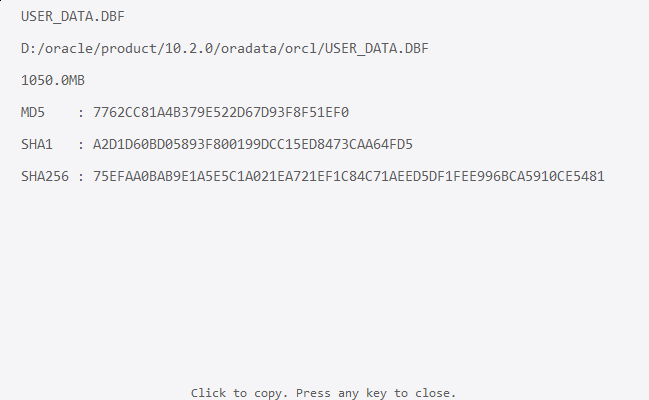

# HashTool Windows下的右键工具

1.作用

Windows 下的文件右键工具, 使用PyQt5框架, 计算文件的 Hash 值. 点击某一项可将其值复制到剪贴板.  
示例:  

2.安装

进入应用根目录, 以管理员权限执行命令 `python install.py`, 将应用加入到右键菜单.  
卸载可使用命令 `python uninstall.py`
  
3.用法

在文件上右键
